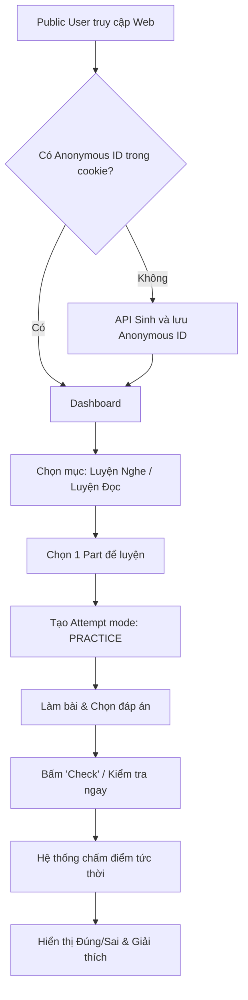
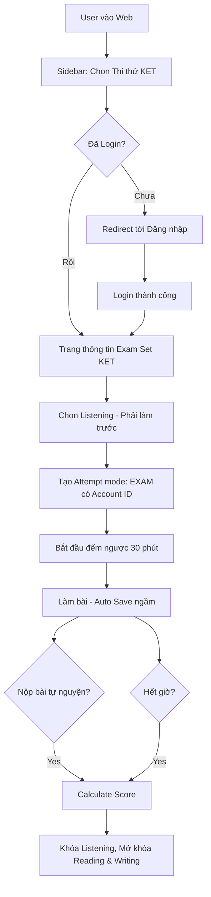
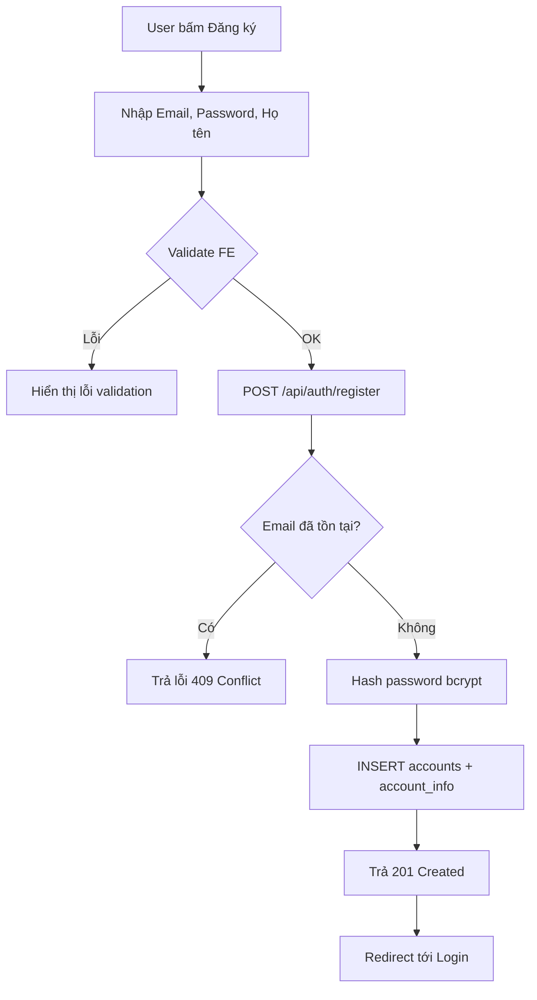
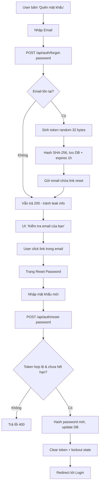
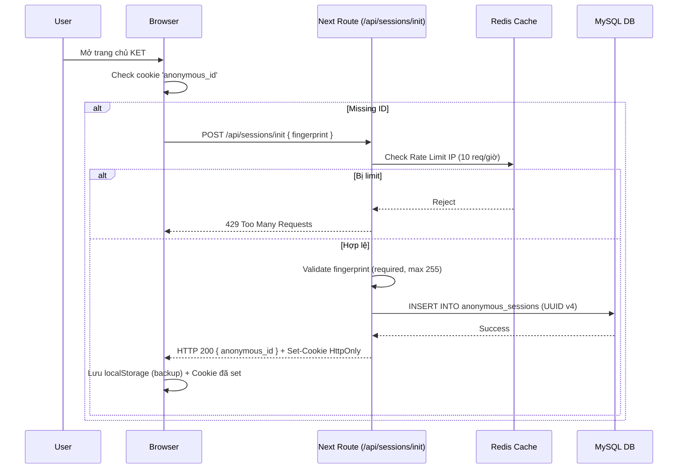
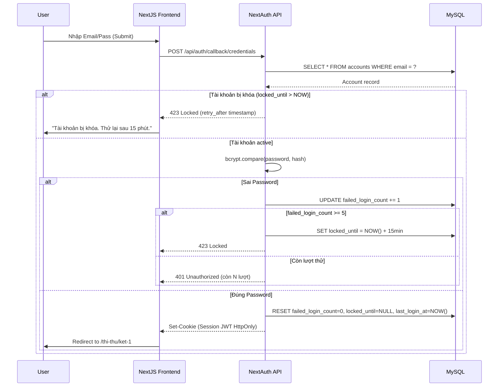
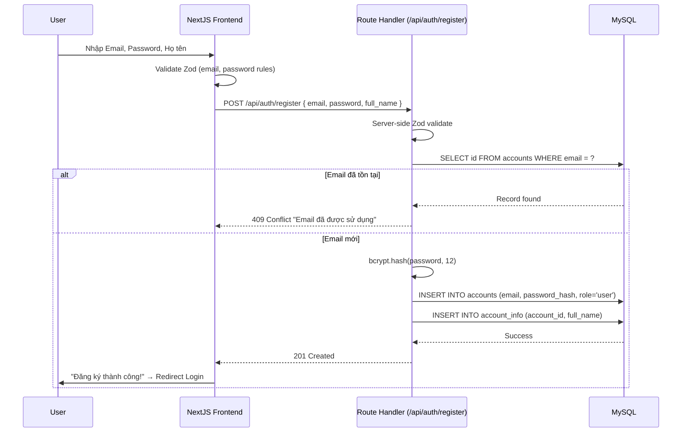
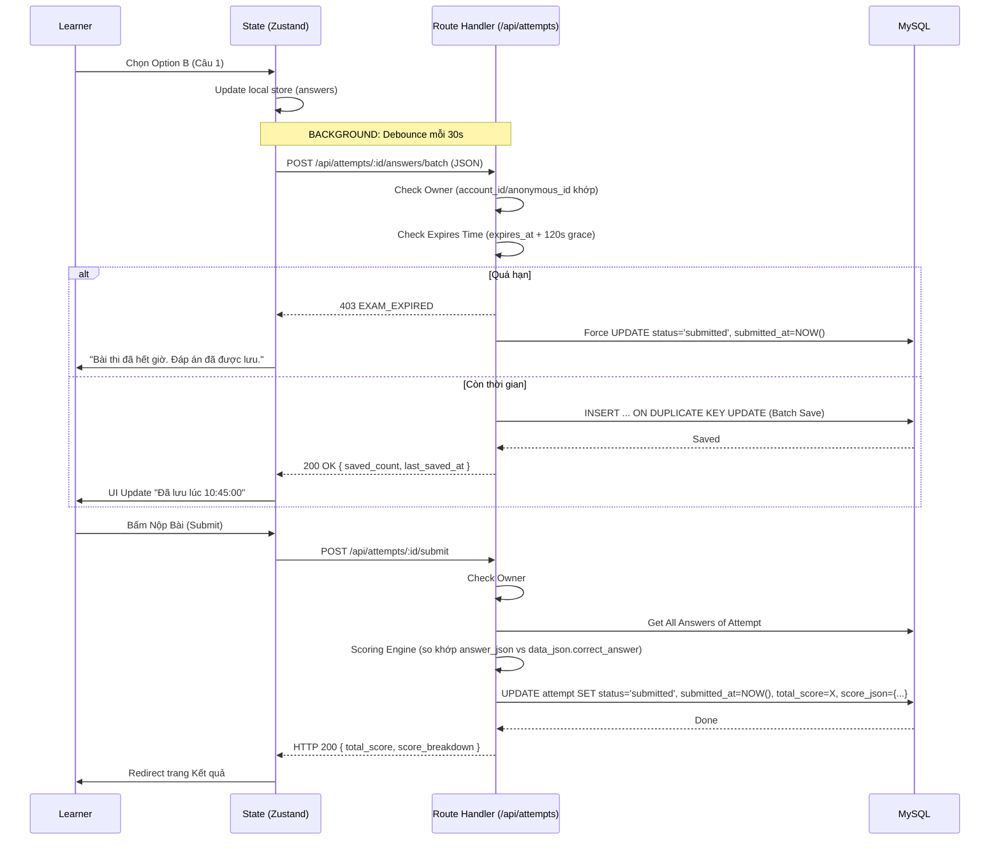
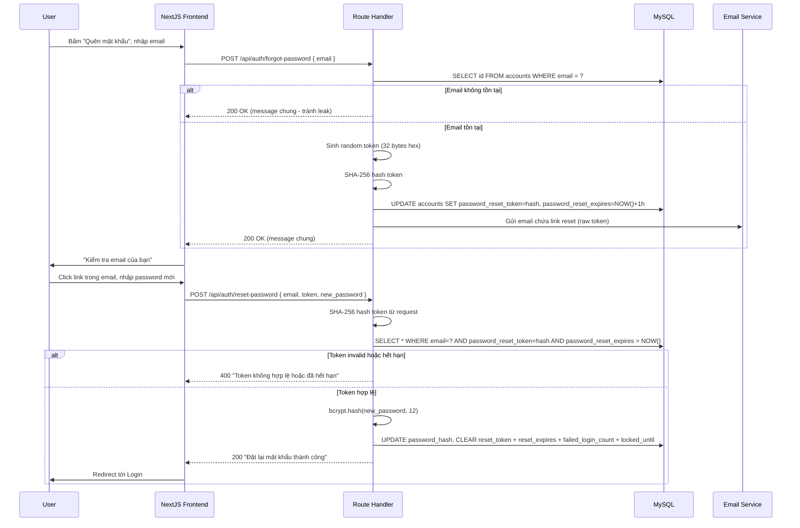
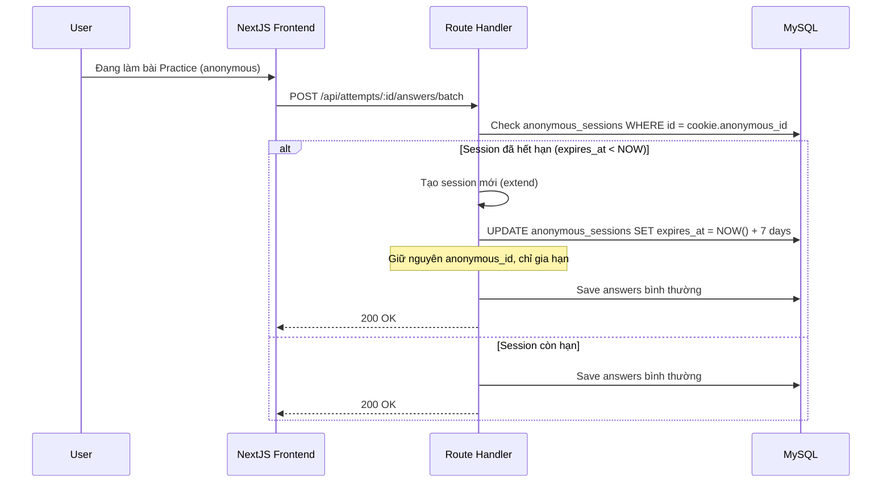

# Business Flows & Sequence Diagrams

Tài liệu này minh họa luồng nghiệp vụ (Business Flow) và biểu đồ trình tự (Sequence Diagram) cho các quy trình cốt lõi của hệ thống KET Platform.

---

## 1. Luồng Kinh Doanh (Business Flows)

### 1.1. Luồng Ôn luyện Kỹ năng (Practice Flow - Public)

### 1.2. Luồng Thi Thử (Mock Exam Flow - Private)

### 1.3. Luồng Đăng ký Tài khoản (Registration Flow)

### 1.4. Luồng Quên Mật Khẩu (Forgot Password Flow)

---

## 2. Sequence Diagrams (Biểu đồ tuần tự)

### 2.1. Khởi tạo phiên ẩn danh (Bảo mật Anonymous ID)

> **⚠️ Lưu ý bảo mật:** Server set `anonymous_id` vào HttpOnly cookie. Các API sau đọc từ cookie — KHÔNG tin client gửi trong request body.

### 2.2. Login (NextAuth JS) với Account Lockout

### 2.3. Đăng ký tài khoản (Register)

### 2.4. Logic Auto-save & Submit bài thi

### 2.5. Quên mật khẩu (Forgot Password)

### 2.6. Xử lý Anonymous Session hết hạn giữa chừng

